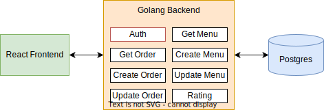

# Food Order System ( GO Backend )

[frontend repository (React)](https://github.com/fangjjcs/Food-Order-System-React-Frontend)

 

## Architecture

 

## Screenshots

Home Page Shows All Menu List

 

Random Choosing Menu With Random Mechanism

Create Menu View

 

Today's Opened Menu View

Order

 

View / Edit / Delete Order

 

Manage / Edit Menu At Admin Page

 

## Installed Packages

github.com/joho/godotenv v1.4.0\
github.com/julienschmidt/httprouter v1.3.0\
github.com/justinas/alice v1.2.0\
github.com/lib/pq v1.10.0\
github.com/pascaldekloe/jwt v1.10.0\
golang.org/x/crypto v0.0.0-20220131195533-30dcbda58838\

 

## How to use this repo

1. download and run : `go run ./cmd/api/*.go`

2. you can reference my [frontend repository (React)](https://github.com/fangjjcs/Food-Order-System-React-Frontend) for this project.

3. build db connection, or you can reference my Postgres [DDL](./psql.txt)